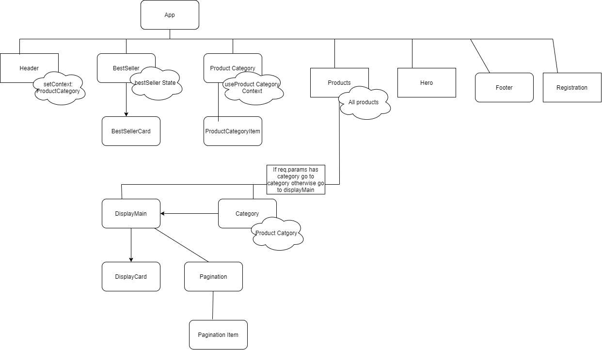

<h1> Shopmart First Assignment Guide </h1>
Link to website: https://eloquent-feynman-3510c7.netlify.app/   

  

<h2>How The App works  </h2>

<h3> 1.Header Component</h3>

 The first component to load is header, it uses sets the productCategory context api because it drags the product category from the api . 
<h4>What it contains?  </h4>
<ul>
  <li>Image </li>
  <li>Search Bar</li>
  <li>Products Link</li>
  <li>Register Link</li>
   <li>Dynamically loaded category links</li>
</ul>
it gets data from this end point fetch {process.env.REACT_APP_BACKEND}/products/categories and puts it in the contextAPI

<h3> 2. Hero Component</h3>

 Uses React slick to create multi carousel items, no states used, Images used here were created using canva.com. 

<h3> 3. Productcategory Component</h3>

uses the categories context to map its child ProductCitem, which is just a component that contains cards.  

<h4> ProductCitem </h4>
It is a child of Product category component, it checks the category it recieves and changes the image based on category.
